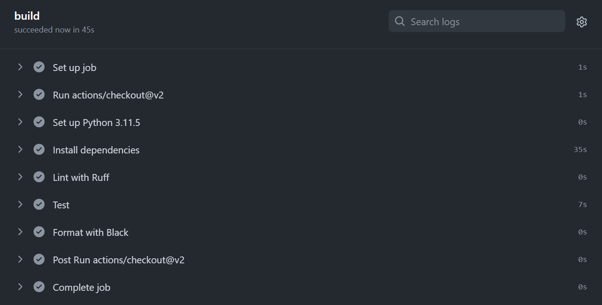
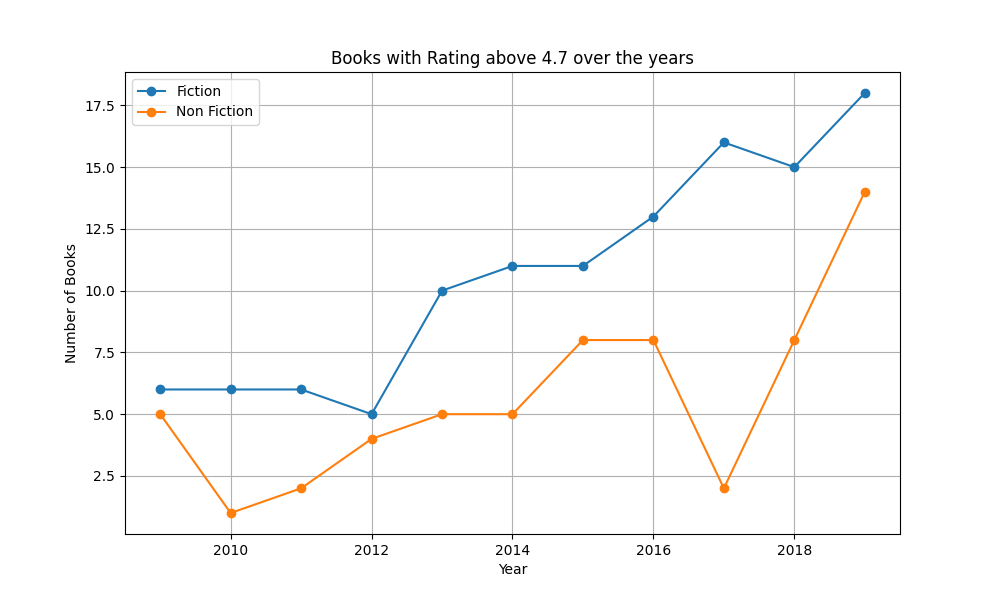
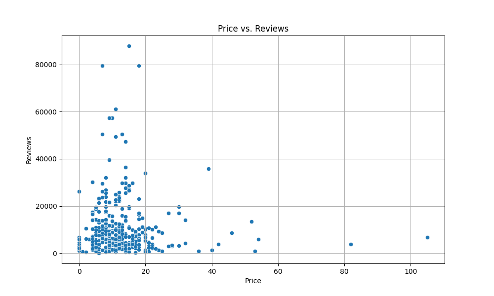
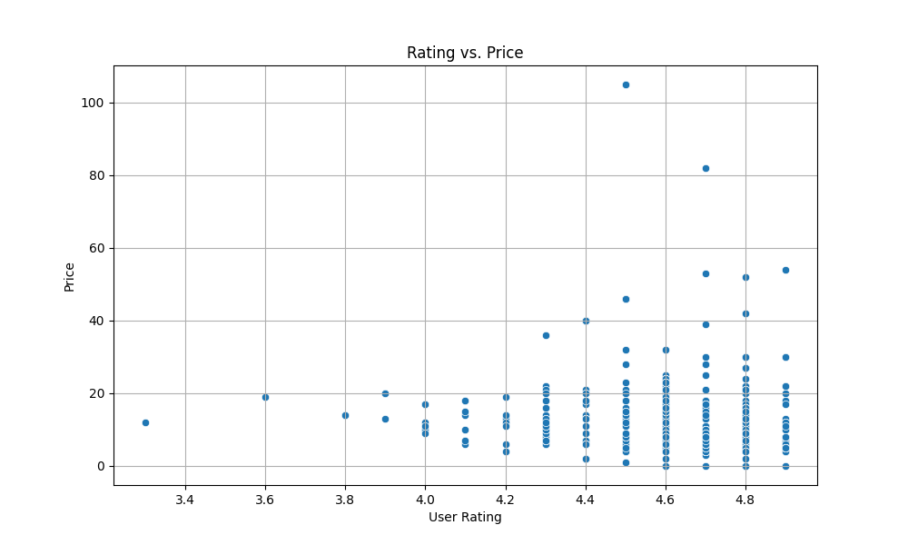
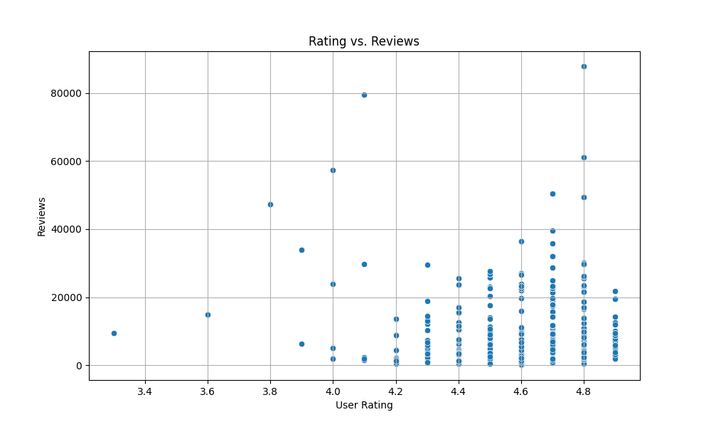

# Continuous Integration using GitHub Actions of Python Data Science Project

This repository showcases the integration and automation of a Python Data Science project using GitHub Actions.

## 📁 Project Structure

- **data_analysis.ipynb**: A Jupyter Notebook detailing the descriptive analysis of Amazon's Top 50 Bestselling Books from 2009-2019.
- **data_analysis_script.py**: A Python script performing similar data analysis as the Jupyter notebook.
- **lib.py**: A shared library file containing utility functions used across the notebook and script.
- **requirements.txt**: A list of Python dependencies for the project.
- **Makefile**: Contains commands related to testing, formatting, and linting.
- **test_data_analysis.py**: Test script for `data_analysis`.
- **test_lib.py**: Test script for functions in `lib.py`.
- **GitHub Actions**: Configurations for automating tasks like running tests, linting, and formatting.

## 📊 Jupyter Notebook - data_analysis.ipynb

This notebook provides a step-by-step analysis of Amazon's Top 50 Bestselling Books from 2009-2019. It begins by importing utility functions from `lib.py` and then delves into a detailed analysis including:
- Summary statistics for the dataset.
- Descriptive statistics grouped by year and genre.
- Visualization of data trends over the years.

## 📜 Python Script - data_analysis_script.py

The Python script performs data analysis similar to the notebook but is more streamlined. It focuses on:
- Loading the dataset.
- Extracting specific insights, such as the number of books each year with reviews over 10,000.

## 🔧 Shared Library - lib.py

The `lib.py` file contains utility functions that are reused in both the Jupyter notebook and the Python script. Key functions include:
- `load_csv()`: Loads a CSV file and returns a DataFrame.
- `get_correlation()`: Calculates the correlation between two columns in a DataFrame.

## ⚙️ Testing

The project includes test scripts (`test_data_analysis.py` and `test_lib.py`) ensuring the accuracy and efficiency of the main script and the shared library.

## 📦 Requirements

Dependencies for the project are listed in `requirements.txt`. Ensure to install them using `pip install -r requirements.txt`.

## 🚀 GitHub Actions

This project utilizes GitHub Actions for Continuous Integration. It automates tasks like:
- Running all tests (notebook, script, lib).
- Formatting code with Python Black.
- Linting code with Ruff.
Below shows the successful Github Action result.

Below are the plots for data visulization in this project.

## 📊 Vedio Demo
https://www.loom.com/share/a9544e3a54094e7b897089655ff8f4d8?sid=eb2120a2-01ae-494f-98d4-5963b7d4722e

